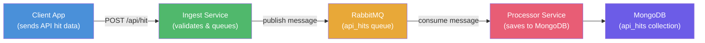
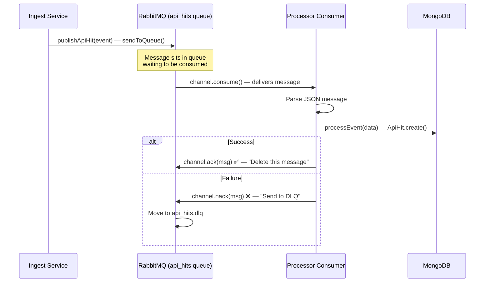

# 🗺️ API Monitoring — Complete Architecture & Flow Walkthrough

## The Big Picture

Your project is an **API Hit Monitoring System** — clients send data about their API usage, and your system ingests, queues, and processes that data. It uses a **modular monolith** architecture with RabbitMQ as a message queue between the **ingest** and **processor** services.



---

## Complete Data Flow (Step by Step)

Here's exactly what happens when an API hit arrives:

### Step 1️⃣ — HTTP Request Arrives
A client sends a `POST /api/hit` request with data like:
```json
{
  "serviceName": "user-service",
  "endpoint": "/api/users",
  "method": "GET",
  "statusCode": 200,
  "latencyMs": 45
}
```

### Step 2️⃣ — Route & Middleware
File: `server/src/services/ingest/routes/ingestRoutes.js`

The request passes through:
1. **`validateApiKey`** middleware — verifies the client's API key, attaches `req.client` and `req.apiKey`
2. **`ingestLimiter`** — rate limits to 1000 requests per 15 minutes
3. **`ingestHit`** controller — handles the request

### Step 3️⃣ — Controller Prepares Data
File: `server/src/services/ingest/controller/ingestController.js`

The controller:
- Extracts `clientId` and `apiKeyId` from the authenticated request
- Adds `ip` and `userAgent` from headers
- Calls `ingestApiHit(hitData)` in the service layer

### Step 4️⃣ — Service Validates & Publishes to Queue
File: `server/src/services/ingest/services/ingestService.js`

This is the core logic:
1. **Validates** required fields (`serviceName`, `endpoint`, `method`, `statusCode`, `latencyMs`, `clientId`)
2. **Validates** HTTP method and status code ranges
3. **Creates an event** with a UUID `eventId` and timestamp
4. **Publishes** the event to RabbitMQ via `publishApiHit(event, "api_hits")`
5. **Returns** `{ status: "queued" }` or `{ status: "rejected" }` (if circuit breaker is open)

### Step 5️⃣ — Producer Sends to RabbitMQ
File: `server/src/shared/events/producer/eventProducer.js`

The producer:
1. Checks the **Circuit Breaker** — if too many failures happened recently, rejects the request
2. **Retries up to 3 times** if publishing fails
3. Sends a JSON message to the `api_hits` queue with `persistent: true`

The message in the queue looks like:
```json
{
  "type": "API_HIT",
  "data": { "eventId": "...", "serviceName": "...", "endpoint": "...", ... },
  "publishedAt": "2026-06-05T..."
}
```

### Step 6️⃣ — 🚨 CONSUMER (the missing link) 🚨
File: `server/src/services/processor/consumer.js`

The **consumer** needs to:
1. **Connect** to RabbitMQ and listen to the `api_hits` queue
2. **Receive** messages from the queue
3. **Parse** the JSON message
4. **Call** the `ProcessorService` to save data to MongoDB
5. **Acknowledge** the message (tell RabbitMQ "I processed it, delete it")

### Step 7️⃣ — Processor Service Saves to MongoDB
File: `server/src/services/processor/service/ProcessorService.js`

This is already written — it takes event data and calls `ApiHit.create(eventData)` to save to MongoDB.

> ⚠️ **Broken Import**: This file imports from `'../models/ApiHit.js'` but there is NO `models/` folder inside the processor directory. The actual model is at `server/src/shared/models/ApiHits.js`. This import path needs to be fixed.

---

## 📂 File Map — What Each File Does

### Ingest Service (✅ DONE)
| File | Purpose |
|------|---------|
| `server/src/services/ingest/routes/ingestRoutes.js` | Defines `POST /api/hit` route with API key validation + rate limiting |
| `server/src/services/ingest/controller/ingestController.js` | Extracts client info from request, calls service layer |
| `server/src/services/ingest/services/ingestService.js` | Validates data, creates event, publishes to RabbitMQ |

### Producer / Queue (✅ DONE)
| File | Purpose |
|------|---------|
| `server/src/shared/events/producer/eventProducer.js` | Publishes messages to RabbitMQ with retry logic |
| `server/src/shared/events/producer/CircuitBreaker.js` | Stops sending to RabbitMQ if 5+ consecutive failures (protects system) |
| `server/src/shared/events/producer/RetryStrategy.js` | Early draft of retry logic (superseded by eventProducer.js) |

### Processor Service (🚧 IN PROGRESS)
| File | Status | Purpose |
|------|--------|---------|
| `server/src/services/processor/consumer.js` | ❌ **EMPTY** | Should listen to RabbitMQ queue and process messages |
| `server/src/services/processor/service/ProcessorService.js` | ⚠️ Broken import | Saves event data to MongoDB via the ApiHit model |
| `server/src/services/processor/repository/ApiHitRepository.js` | ⚠️ Broken import | CRUD operations for API hits in MongoDB (save, find, count, delete) |

### Shared / Models (✅ DONE)
| File | Purpose |
|------|---------|
| `server/src/shared/models/ApiHits.js` | Mongoose schema/model for `api_hits` collection |
| `server/src/shared/config/rabbitmq.js` | RabbitMQ connection, channel, queue setup, DLQ config |

---

## 🔧 What You Need To Do Next

### Priority 1: Fix the Broken Imports

Both `ProcessorService.js` and `ApiHitRepository.js` import from `'../models/ApiHit.js'` but that path doesn't exist. They should import from the shared model:

```diff
- import ApiHit from '../models/ApiHit.js';
+ import ApiHit from '../../../shared/models/ApiHits.js';
```

### Priority 2: Write the Consumer (consumer.js)

This is the missing link. The consumer connects the RabbitMQ queue to your processor service. Here's the pattern you need:

```javascript
// consumer.js — The missing piece

import { getChannel } from '../../shared/config/rabbitmq.js';
import config from '../../shared/config/index.js';
import logger from '../../shared/config/logger.js';
import { processEvent } from './service/ProcessorService.js';

/**
 * Start consuming messages from the api_hits queue
 */
export async function startConsumer() {

    try {
        const channel = getChannel();

        if (!channel) {
            throw new Error('RabbitMQ channel not available');
        }

        const queueName = config.rabbitmq.queue;  // "api_hits"

        // Process only 1 message at a time
        // (don't overwhelm MongoDB)
        channel.prefetch(1);

        logger.info(`[Consumer] Listening on queue: ${queueName}`);

        // Start consuming messages
        channel.consume(queueName, async (msg) => {

            if (!msg) return;

            try {
                // Step 1: Parse the message
                const content = JSON.parse(msg.content.toString());
                const eventData = content.data;

                logger.info('[Consumer] Message received', {
                    eventId: eventData.eventId,
                    type: content.type
                });

                // Step 2: Process (save to MongoDB)
                await processEvent(eventData);

                // Step 3: Acknowledge — tell RabbitMQ "done, delete this message"
                channel.ack(msg);

                logger.info('[Consumer] Message processed & acknowledged', {
                    eventId: eventData.eventId
                });

            } catch (error) {

                logger.error('[Consumer] Error processing message:', error);

                // Reject message and send to Dead Letter Queue (DLQ)
                // false = don't requeue (send to DLQ instead)
                channel.nack(msg, false, false);
            }
        });

    } catch (error) {

        logger.error('[Consumer] Failed to start consumer:', error);
        throw error;
    }
}
```

### Priority 3: Start the Consumer When Server Starts

In `server/src/server.js`, after the connections are established, you need to start the consumer:

```diff
  import { connectRabbitMQ, closeRabbitMQ } from './shared/config/rabbitmq.js';
+ import { startConsumer } from './services/processor/consumer.js';

  // Inside initializeConnection(), after connectRabbitMQ():
  await connectRabbitMQ();
+ await startConsumer();
```

---

## 🧠 Key Concept: The RabbitMQ Message Lifecycle



### Why `ack` and `nack`?
- **`channel.ack(msg)`** — "I processed this message successfully. You can delete it from the queue."
- **`channel.nack(msg, false, false)`** — "I failed to process this. Don't requeue it, send it to the Dead Letter Queue (DLQ) so we can investigate later."

If you don't acknowledge, RabbitMQ will keep the message and redeliver it when the consumer reconnects. This prevents data loss.

---

## ⚠️ Issues Found in the Codebase

| Issue | Location | Fix |
|-------|----------|-----|
| Broken import path `'../models/ApiHit.js'` | `ProcessorService.js` line 1 | Change to `'../../../shared/models/ApiHits.js'` |
| Broken import path `'../models/ApiHit.js'` | `ApiHitRepository.js` line 1 | Change to `'../../../shared/models/ApiHits.js'` |
| Broken import `'./logger.js'` in CircuitBreaker | `CircuitBreaker.js` line 1 | Should be `'../../config/logger.js'` |
| Import path mismatch for eventProducer | `ingestService.js` line 4 | `../../producer/eventProducer.js` resolves outside services — verify this path is correct |
| `consumer.js` is empty | `processor/consumer.js` | Needs to be implemented (see code above) |
| `RetryStrategy.js` is unused/duplicate | `shared/events/producer/RetryStrategy.js` | The retry logic is already in `eventProducer.js` — this file can be deleted |
